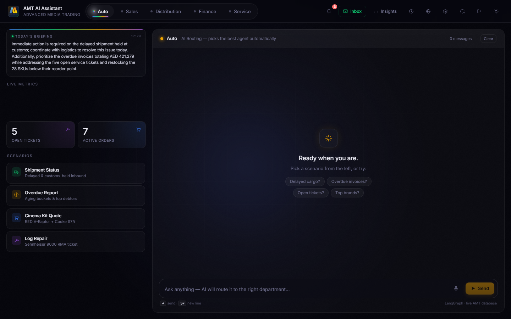
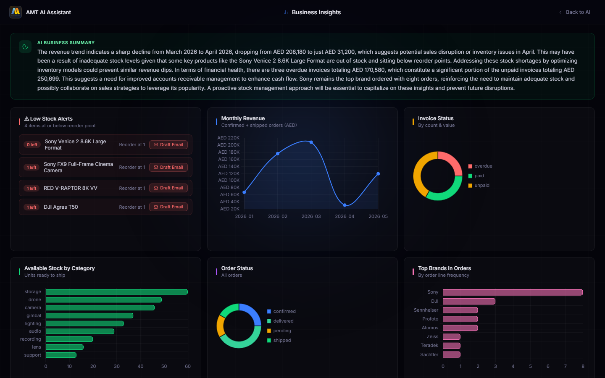
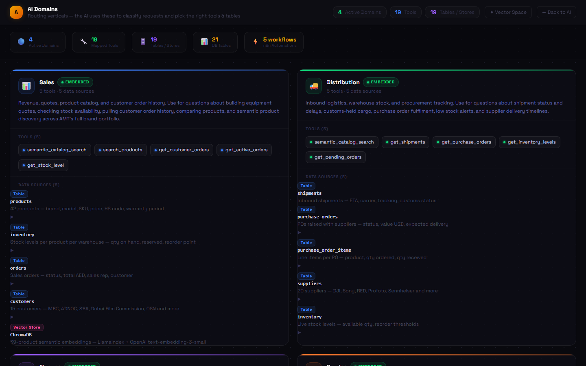
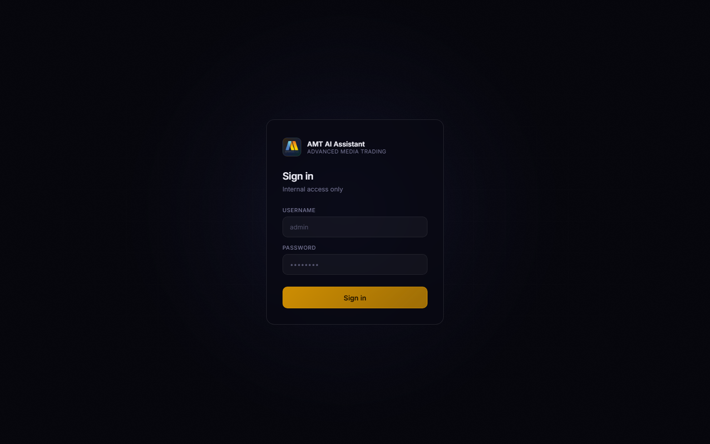

# AMT AI Assistant

> AI-powered department assistant for **Advanced Media Trading LLC** — the largest professional AV equipment distributor in MENA.

Built as a live internal demo showing non-technical department heads exactly how AI simplifies their daily work. No buzzwords. Real data, real queries, real answers.

---

## Screenshots

### Dashboard


### Business Insights


### AI Domains Explorer


### Login


---

## What It Does

Four AI agents, each wired to a live SAP-aligned database of real AMT data:

| Department | What the AI handles |
|---|---|
| **Sales** | Build equipment quotes, check live stock, pull customer order history, semantic product search |
| **Distribution** | Track inbound shipments, flag customs holds & delays, monitor POs, inventory levels, AI-drafted reorder emails |
| **Finance** | Overdue invoices, revenue summaries, aging reports, customer balances, multi-country VAT (UAE 5% / KSA 15% / Egypt 14%) |
| **Service** | View repair tickets, log new ones, update status, trigger automated customer email notifications via n8n |

Every response is grounded in real database queries — the AI never hallucinates numbers.

---

## Stack

| Layer | Technology |
|---|---|
| **Orchestration** | LangGraph — StateGraph routes each message to the right department agent |
| **LLM** | GPT-4o via OpenAI function calling |
| **Semantic Search** | LlamaIndex + ChromaDB — 42-product vector store (1,536-dim embeddings) |
| **Tool Dispatch** | LangChain StructuredTool wrappers |
| **Financial Analysis** | Pandas — aging reports, payment rates, monthly revenue trends |
| **Observability** | LangSmith — full trace of every agent run |
| **Automation** | n8n — 5 live workflows, fires real Gmail emails on ticket events |
| **Database** | SQLite — SAP SD/MM/FI/CS aligned schema (20+ tables) |
| **Backend** | Python + Flask — session auth, login-protected routes |
| **Frontend** | Custom HTML/CSS/JS — per-department theming, live tool trace panel, light/dark mode |

---

## Project Structure

```
AMT_Demo/
├── app.py                       # Flask server — routes, auth, stats, briefing, LangSmith init
├── requirements.txt
├── .env.example                 # Copy to .env and fill in your keys
├── start.bat                    # Double-click to launch (Windows)
│
├── agents/
│   ├── langgraph_flow.py        # LangGraph StateGraph router (entry point for every message)
│   ├── trace.py                 # Thread-local tool trace — fires per request
│   ├── domains_config.py        # Single source of truth for domain metadata
│   ├── reports.py               # HTML report generators (distribution briefing, finance overdue)
│   ├── sales.py                 # Quote builder, product search, order history, RFQ handler
│   ├── distribution.py          # Shipments, purchase orders, inventory, reorder
│   ├── finance.py               # Invoices, revenue, Pandas aging reports
│   ├── service.py               # Ticket CRUD, customer email drafting
│   ├── vector_store.py          # LlamaIndex + ChromaDB semantic search
│   ├── gmail_imap.py            # IMAP inbox fetch + Gmail send
│   └── email_classifier.py      # Classify inbound emails by department
│
├── db/
│   ├── schema.sql               # Full SAP-aligned schema: branches, employees, suppliers,
│   │                            #   products, inventory, customers, POs, orders,
│   │                            #   invoices, service_tickets, warranties + more
│   ├── seed.py                  # Realistic AMT data — see Sample Data below
│   └── chroma/                  # ChromaDB vector store (auto-generated)
│
├── templates/
│   ├── index.html               # Main chat UI — department switcher, tool trace, stats
│   ├── insights.html            # Business Insights — 8 interactive charts with drill-down
│   ├── mail.html                # Inbox — AI email triage + AI-generated reply drafts
│   ├── domains.html             # AI Domains — agents, tools, table schema explorer
│   ├── embeddings.html          # Vector Space — t-SNE 2D scatter of product embeddings
│   ├── history.html             # Chat history with full tool trace
│   └── login.html               # Session-based login (admin / 1234 by default)
│
├── static/
│   ├── amt_logo.webp
│   ├── favicon.svg
│   └── screenshots/             # README screenshots
│
└── n8n_workflow_update.json     # Import into n8n for live ticket email automation
```

---

## Sample Data

| Entity | Count | Details |
|---|---|---|
| Branches | 4 | Dubai HQ, Al Quoz Warehouse+Service, Riyadh, Cairo |
| Employees | 18 | Real AMT leadership (Kaveh Farnam, Alaa Al Rantisi, Pooyan Farnam, …) |
| Suppliers | 20 | DJI, Sony Professional, RED, ARRI, Zeiss, Profoto, Sennheiser, Atomos, Teradek, … |
| Products | 42 | Real HS codes, cost/sell prices, warranty periods |
| Customers | 15 | MBC Group, ADNOC, Saudi Broadcasting Authority, Dubai Film Commission, OSN, … |
| Orders | 12 | Across delivered, shipped, confirmed, pending states |
| Invoices | 12 | UAE 5% / KSA 15% / Egypt 14% VAT applied correctly |
| Shipments | 5 | Including one customs hold, two in transit |
| Service Tickets | 8 | Dubai + Riyadh, across all repair stages |

---

## Getting Started

**1. Clone**
```bash
git clone https://github.com/Twillur/AMT-AI-Demo.git
cd AMT-AI-Demo
```

**2. Virtual environment**
```bash
python -m venv venv
venv\Scripts\activate        # Windows
source venv/bin/activate     # Mac/Linux
```

**3. Dependencies**
```bash
pip install -r requirements.txt
```

**4. API keys**
```bash
cp .env.example .env
# Edit .env — add your OPENAI_API_KEY at minimum
```

**5. Run**
```bash
python app.py
# or double-click start.bat on Windows
```

Open `http://localhost:5000` — log in with `admin` / `1234`.

> The database seeds itself automatically on first run. To reseed manually: `python db/seed.py`

---

## Demo Queries

**Sales**
> "Give me a quote for a 4K cinema shoot kit under AED 80,000"
> "What's the stock level on DJI Mavic 3 Pro?"
> "Show me all orders for MBC Group"

**Distribution**
> "Show me all delayed or customs-held shipments"
> "What items are running low on stock?"
> "Draft a reorder email for our low DJI stock"

**Finance**
> "Show all overdue invoices"
> "Run a full aging report"
> "What's our total revenue and collection rate for 2026?"

**Service**
> "Show me all open repair tickets"
> "Log a new repair for Rami Yousef — DJI RS 4 Pro, motor overheating"
> "What's the status of ticket SVC-2026-001?"

---

## Key Features

- **Login-protected** — session-based auth, all routes secured
- **Live AI briefing** — GPT-4o-mini writes a 2-sentence morning briefing from live DB data every 10 min
- **Notification bell** — alerts for overdue invoices, delayed shipments, open tickets (persists across pages)
- **Insights charts** — 8 clickable Chart.js charts with row-level drill-down modals
- **AI reorder emails** — GPT-4o-mini drafts supplier emails from live product + supplier DB data
- **Vector Space** — interactive t-SNE scatter plot of all 42 product embeddings
- **n8n automation** — ticket create/update fires real Gmail emails automatically
- **Light / dark mode** — persists across all pages via localStorage

---

## Design Philosophy

> *"Don't try to change the whole business. Make the individual person's daily tasks easier. Once daily tasks are easy, the convincing is done."*
>
> — Bilal, AMT

This demo is intentionally personal and non-technical. Each department head sees a tool built around their exact workflow — not a generic AI chatbot.

---

Built by [William Kojumian](https://github.com/Twillur)
